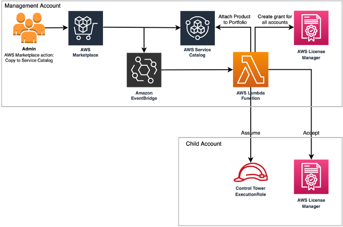

# Automating distribution of AWS Marketplace entitlements with AWS Private Marketplace and AWS Service Catalog

AWS Marketplace enables you to subscribe to software products and services from the curated public catalog. It also enables you to create a Private Marketplace experiences which are a catalogs of approved products. In this solution we are using AWS Private Marketplace experience associated to the management account, which is used as a central hub for distributing entitlements to all of the linked accounts in the AWS Oragniation.

After you have subscribed to an AWS Marketplace product, you can distribute the product entitlement to accounts that are part of your landing zone in your multi-account AWS environment.  In this solution we will use both AWS License Manager and AWS Service Catalog, to distribute approved server based AWS Marketplace products with active subscriptions.

This automated entitlement distribution solution replaces two workflows. First is the creation and activation of subscribed products license by automating AWS License Manager grants. Second, by automating the relevant AWS Service Catalog portfolio creation, product definition, and association of subscribed Private Marketplace product to portfolio tasks. The trigger to automated distribution is an Amazon EventBridge rule that watches out for the ImporttoServiceCatalog API call made by Private Marketplace admins.
Figure 1 represent a high-level flow of the solution architecture. Private Marketplace admin triggers this flow by initiating an AWS Marketplace product Copy to Service Catalog action. EventBridge traps this action then invoke an AWS Lambda function that implement and monitor the necessary AWS Service Catalog portfolio tasks. 

## Prerequisites
- Child accounts must be enrolled in the same AWS Organizations as the management account.
- Your Private Marketplace experience must be in enabled state. 
- Enable trusted access with License Manager in the AWS Accounts
- Enable trusted access for AWS Marketplace - License Management

## Deployment

Create a stack that deploys AWS resources including an AWS Lambda function, an EventBridge rule, AWS License grant and activation and an AWS Service Catalog portfolio from the provided AWS CloudFormation template in the payer AWS account. The template implements event-driven automation that generates subscribed AWS Marketplace product entitlement grant for child accounts on AWS License Manager. It also adds the subscribed AWS Marketplace product to that AWS Service Catalog portfolio, which will be shared across your landing zone.  

Launch the CloudFormation stack [stack.yaml](./stack.yaml).

This template performs the following functions automatically:
1.	When the Private Marketplace admin triggers the ImporttoServicecatalog API call by choosing Copy to Service Catalog in AWS Marketplace product.
2.	The EventBridge rule catches the API call and publishes the event message to a Lambda function resource named privatemarketplace.
3.	For "type":"MARKETPLACE" products and "status":"CREATED" events, the function triggers the following automated portfolio management tasks in AWS Service Catalog:
    - Validates that the portfolio is shared
    - Update the portfolio with new Private Marketplace product association
    - Gracefully handle any exception.
4.	For subscribed AWS Marketplace product events, the Lambada function triggers the following automated AWS License Manager tasks:
    - On management account AWS License Manager, grant subscribed product license to child account.
    - On child account AWS License Manager, accept and activate granted subscribed product license.

## Cleaning up
To avoid incurring future charges, delete all resources that you created via AWS CloudFormation by deleting the stack. Follow the steps below to clean up the deployed resources.
1.	Un-share AWS Service Catalog portfolio PrivateMarketplace
    - In the AWS Service Catalog console, navigate to portfolio and choose the PrivateMarketplace portfolio created as part of the automation stack deployed in Step 3.
    - Select the Share tab and un-share each entry. 
2.	Delete automation stack on AWS CloudFormation console, choose stack and select Delete stack.

